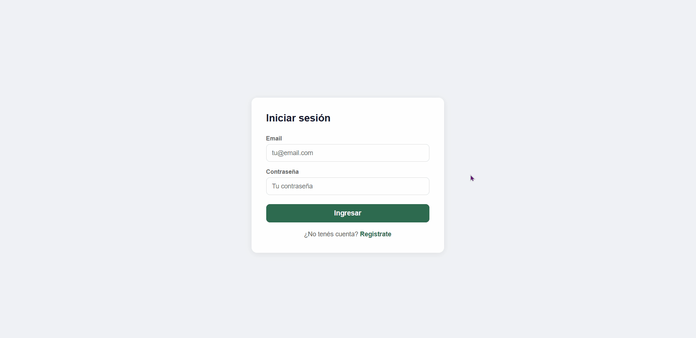

# Sistema de Turnos Fullstack

Aplicación web fullstack para gestión de turnos médicos, peluquerías y entrenadores personales.



## 🔗 Demo en vivo

[Ver aplicación](https://sistema-turnos-fullstack.vercel.app/login)

## 🛠 Tecnologías

**Frontend:** React, Vite, React Router, Axios, FullCalendar  
**Backend:** Node.js, Express, JWT, bcrypt  
**Base de datos:** PostgreSQL, Sequelize ORM  
**Deploy:** Vercel (frontend) + Railway (backend)

## ✨ Funcionalidades

- Registro e inicio de sesión con autenticación JWT
- Contraseñas encriptadas con bcrypt
- Crear, modificar y cancelar turnos
- Vista de calendario mensual interactivo
- Rutas protegidas por middleware
- Cada usuario ve únicamente sus propios turnos
- Diseño responsive para mobile y desktop

## 🚀 Instalación local

### Backend
```bash
cd server
npm install
npm run dev
```

### Frontend
```bash
cd client
npm install
npm run dev
```

### Variables de entorno — `server/.env`
```
PORT=3000
JWT_SECRET=tu_clave_secreta
DB_HOST=localhost
DB_PORT=5432
DB_NAME=turnos_db
DB_USER=postgres
DB_PASSWORD=tu_password
```